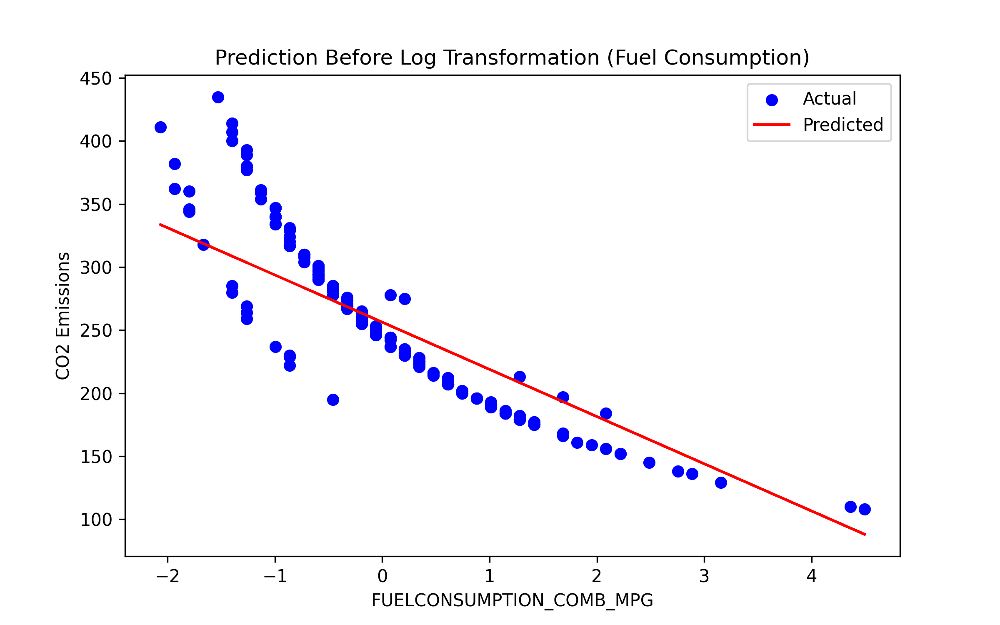
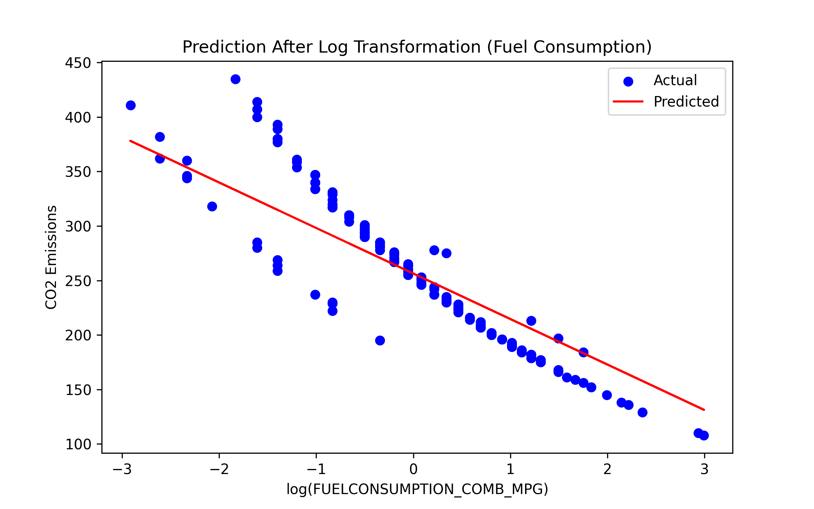
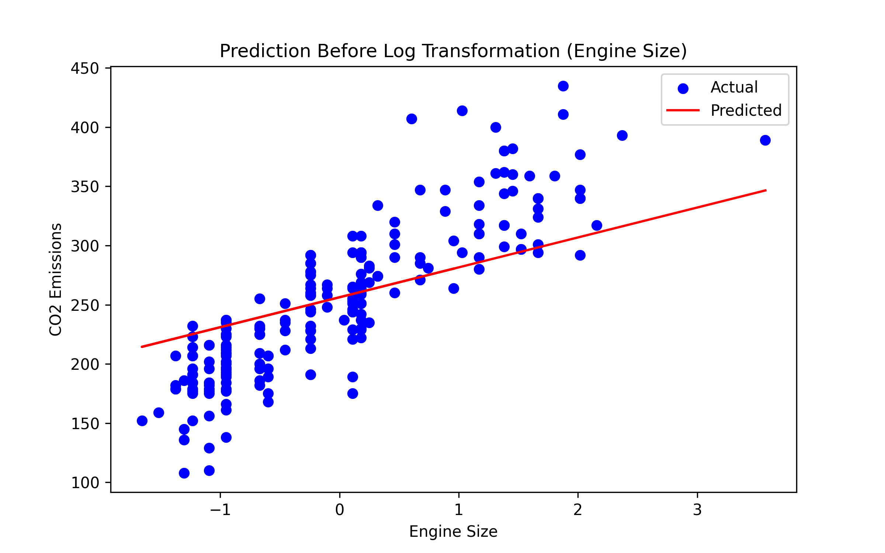
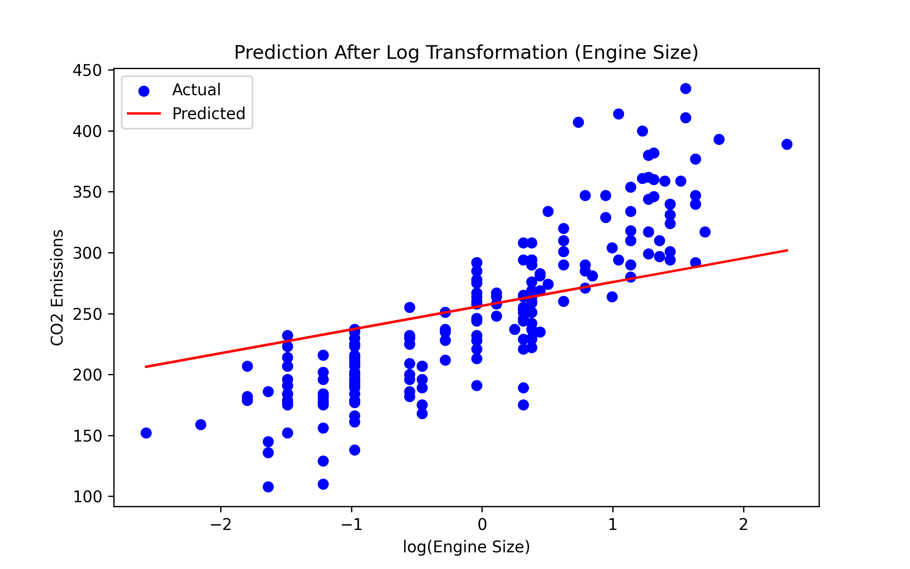

# 🚗 CO2 Emissions Prediction using Linear Regression

This machine learning project predicts **CO2 emissions (g/km)** from vehicles using **Multiple Linear Regression**. It also explores how feature transformations like logarithmic scaling and data standardization can improve model performance.

---

## 📌 Objective

- Predict CO2 emissions using features such as **engine size** and **fuel consumption**.
- Apply data preprocessing and transformations.
- Evaluate model performance before and after logarithmic transformation.
- Perform cross-validation for robust evaluation.

---

## 🧠 Techniques Used

- **Exploratory Data Analysis (EDA)**
  - Visualizations (scatter matrix).
  - Feature selection based on correlation matrix.

- **Data Preprocessing**
  - Dropping irrelevant features.
  - Standardization using `StandardScaler`.
  - Logarithmic transformation to reduce skewness and improve linearity.

- **Modeling**
  - Multiple Linear Regression using `scikit-learn`.
  - Training on both original and log-transformed data.
  - Recovering original-scale coefficients for interpretation.

- **Model Evaluation**
  - Mean Absolute Error (MAE)
  - Mean Squared Error (MSE)
  - Root Mean Squared Error (RMSE)
  - R² Score
  - 5-Fold Cross-Validation for model reliability

---

## 📈 Results Summary

| Model Variant                | MAE   | MSE    | RMSE  | R² Score        |
|-----------------------------|--------|--------|--------|------------------|
| **Before Log Transform**    | 14.29  | 466.11 | 21.59  | 88%              |
| **After Log Transform**     | 13.90  | 470.08 | 21.68  | 89%              |
| **Cross-Validation (Log)**  | —      | —      | —      | 86.54% (avg)     |

> ✅ Log transformation + standardization significantly improved the model’s accuracy and generalization ability.

---

## 📊 Sample Visualizations

| Before Log Transform | After Log Transform |
|----------------------|---------------------|
|  |  |
| *Fuel Consumption vs CO2 (Raw)* | *Fuel Consumption vs CO2 (Log-transformed)* |

| Before Log Transform | After Log Transform |
|----------------------|---------------------|
|  |  |
| *Engine Size vs CO2 (Raw)* | *Engine Size vs CO2 (Log-transformed)* |

---

## 🛠 Requirements

- Python 3.x
- NumPy
- Pandas
- Matplotlib
- scikit-learn

Install using pip:

```bash
pip install numpy pandas matplotlib scikit-learn
```

## 📁 Folder Structure
```bash
.
├── MultipleLinearRegression.ipynb         # Jupyter notebook with full code
├── pyMultiplelinearregression.py             # Python script version
├── FuelConsumptionCo2.csv               # Dataset used
├── README.md
└── assets/
    ├── prediction_before_log_fuel.png
    ├── prediction_before_log_engine.png
    ├── prediction_after_log_fuel.png
    └── prediction_after_log_engine.png

```


